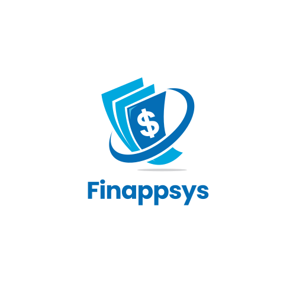

<div id="top"></div>
<!--
*** Thanks for checking out the Best-README-Template. If you have a suggestion
*** that would make this better, please fork the repo and create a pull request
*** or simply open an issue with the tag "enhancement".
*** Don't forget to give the project a star!
*** Thanks again! Now go create something AMAZING! :D
-->

<!-- PROJECT SHIELDS -->
<!--
*** I'm using markdown "reference style" links for readability.
*** Reference links are enclosed in brackets [ ] instead of parentheses ( ).
*** See the bottom of this document for the declaration of the reference variables
*** for contributors-url, forks-url, etc. This is an optional, concise syntax you may use.
*** https://www.markdownguide.org/basic-syntax/#reference-style-links
-->
[![Contributors][contributors-shield]][contributors-url]
[![Forks][forks-shield]][forks-url]
[![Stargazers][stars-shield]][stars-url]
[![Issues][issues-shield]][issues-url]
[![MIT License][license-shield]][license-url]
[![LinkedIn][linkedin-shield]][linkedin-url]

<!-- PROJECT LOGO -->
<br />
<div align="center">
  <a href="https://github.com/kevin-otter-liu/CZ3002-Project">
    
  </a>

<h3 align="center">Finappsys</h3>

  <p align="center">
    A 1 stop webapp platform for all your financial tracking and statistics
    <br />
    <a href="https://www.youtube.com/watch?v=iG0Q7lon6Vk">View Demo</a>
    ·
    <a href="https://github.com/kevin-otter-liu/CZ3002-Project/issues">Report Bug</a>
    ·
    <a href="https://github.com/kevin-otter-liu/CZ3002-Project/issues">Request Feature</a>
  </p>
</div>

# Finappsys Usage
Watch the Youtube Video here:
</br>
</br>
[](https://www.youtube.com/watch?v=iG0Q7lon6Vk)

<!-- TABLE OF CONTENTS -->
<details>
  <summary>Table of Contents</summary>
  <ol>
    <li>
      <a href="#about-the-project">About The Project</a>
      <ul>
        <li><a href="#built-with">Built With</a></li>
      </ul>
    </li>
    <li>
      <a href="#getting-started">Getting Started</a>
      <ul>
        <li><a href="#prerequisites">Prerequisites</a></li>
        <li><a href="#installation">Installation</a></li>
      </ul>
    </li>
    <li><a href="#contact">Contact</a></li>
  </ol>
</details>


<!-- ABOUT THE PROJECT -->
## About The Project
Finappsys is a webapp that aims to aid young adults to be in control of their personal finances by providing a one-stop platform where users can manage their expenditure and budget their spending
<p align="right">(<a href="#top">back to top</a>)</p>


### Built With

* [React.js](https://reactjs.org/)
* [Node.js](https://nodejs.org/)
* [MongoDB](https://www.mongodb.com/)
* [ExpressJS](https://expressjs.com/)
### Deployed with
* [PM2](https://pm2.keymetrics.io/)
* [LinuxOS](https://ubuntu.com/)
* [AWS](https://ubuntu.com/)

<p align="right">(<a href="#top">back to top</a>)</p>


<!-- GETTING STARTED -->
## Getting Started

Following are instructions on setting up your project locally.
To get a local copy up and running follow these simple example steps.

### Prerequisites
Install Node LTS
Install MongoDB


### Installation

1. Clone the repo
   ```sh
   git clone https://github.com/kevin-otter-liu/CZ3002-Project.git
   ```
2. Install NPM packages in `\backend` and `\frontend`
   ```sh
   npm install
   ```
3. Create a local mongoDB database so that the backend can connect to it
3. run server in development mode
   ```sh
   node server.js --development
   ```

<p align="right">(<a href="#top">back to top</a>)</p>

### Deployment (TBC)
...

<!-- CONTRIBUTING -->
## Contributing

Contributions are what make the open source community such an amazing place to learn, inspire, and create. Any contributions you make are **greatly appreciated**.

If you have a suggestion that would make this better, please fork the repo and create a pull request. You can also simply open an issue with the tag "enhancement".
Don't forget to give the project a star! Thanks again!

1. Fork the Project
2. Create your Feature Branch (`git checkout -b feature/AmazingFeature`)
3. Commit your Changes (`git commit -m 'Add some AmazingFeature'`)
4. Push to the Branch (`git push origin feature/AmazingFeature`)
5. Open a Pull Request

<p align="right">(<a href="#top">back to top</a>)</p>

<!-- CONTACT -->
## Contact

Kevin Liu - [@big-otter-codes](https://www.linkedin.com/in/kevin-liu-kai-big-otter-codes/) - kevinliudevelopes@gmail.com

<p align="right">(<a href="#top">back to top</a>)</p>


<!-- MARKDOWN LINKS & IMAGES -->
<!-- https://www.markdownguide.org/basic-syntax/#reference-style-links -->
[contributors-shield]: https://img.shields.io/github/contributors/github_username/repo_name.svg?style=for-the-badge
[contributors-url]: https://github.com/github_username/repo_name/graphs/contributors
[forks-shield]: https://img.shields.io/github/forks/github_username/repo_name.svg?style=for-the-badge
[forks-url]: https://github.com/github_username/repo_name/network/members
[stars-shield]: https://img.shields.io/github/stars/github_username/repo_name.svg?style=for-the-badge
[stars-url]: https://github.com/github_username/repo_name/stargazers
[issues-shield]: https://img.shields.io/github/issues/github_username/repo_name.svg?style=for-the-badge
[issues-url]: https://github.com/github_username/repo_name/issues
[license-shield]: https://img.shields.io/github/license/github_username/repo_name.svg?style=for-the-badge
[license-url]: https://github.com/github_username/repo_name/blob/master/LICENSE.txt
[linkedin-shield]: https://img.shields.io/badge/-LinkedIn-black.svg?style=for-the-badge&logo=linkedin&colorB=555
[linkedin-url]: https://linkedin.com/in/linkedin_username
[product-screenshot]: images/screenshot.png

